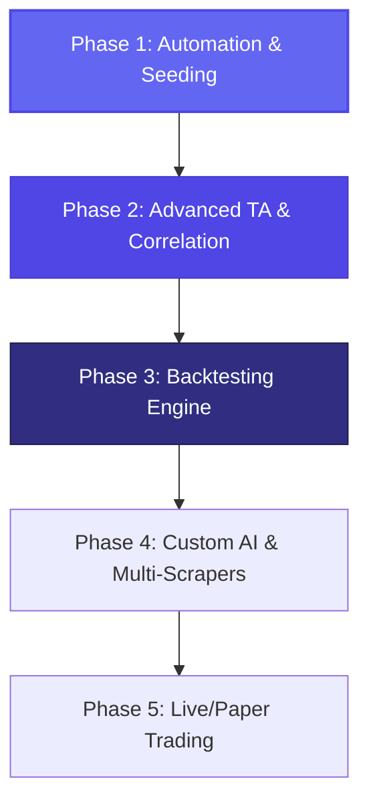

# 🚀 Roadmap & Evoluzioni Future - Trading & Sentiment AI (FinanceBuddy)

Questo documento definisce la visione strategica a breve, medio e lungo termine per l'evoluzione della piattaforma. La roadmap è suddivisa in step incrementali, ciascuno con indicazione degli obiettivi di business/funzionali e dello stack tecnologico consigliato.

---

---

## 📅 Fase 1: Automazione & Bootstrapping (Futuro Immediato)
**Obiettivo:** Consolidare l'applicazione self-hosted, automatizzare il caricamento iniziale ed ottimizzare le performance delle code Celery.

* **Funzionalità:**
  * Bootstrapping automatico dei dati storici (`yfinance` + notizie) al primo avvio tramite il comando `bootstrap_assets`.
  * Orchestrazione completa in Docker Compose (Web, DB, Redis, Worker, Beat).
  * Memorizzazione persistente dei modelli HuggingFace (FinBERT) per evitare download ripetuti su volumi Docker.
* **Tecnologie:**
  * **Backend:** Python 3.11+, Django 5.x, Celery 5.x.
  * **Database:** PostgreSQL 15+ (Alpine), Redis 7+ (Broker Celery).
  * **NLP:** HuggingFace Transformers, PyTorch (CPU-only per preservare memoria).
  * **Frontend:** TailwindCSS, Alpine.js, TradingView Lightweight Charts.

---

## 📈 Fase 2: Indicatori Tecnici & Correlazioni Avanzate (Futuro Prossimo)
**Obiettivo:** Unire l'analisi fondamentale guidata dal sentiment con l'analisi tecnica (TA) quantitativa.

* **Funzionalità:**
  * **Grafico a Doppia Timeline:** Visualizzazione degli indicatori tecnici principali (RSI, MACD, Medie Mobili Esponenziali EMA 20/50/200) sovrapposti alle candele dei prezzi.
  * **Matrice di Correlazione Matematica:** Calcolo automatico e visualizzazione dei coefficienti di correlazione di Pearson/Spearman tra i picchi di sentiment e le variazioni di prezzo a 1, 3 e 7 giorni.
  * **Sistema di Alert Automatici:** Invio di notifiche push (Telegram, Email, o Discord) quando un asset monitorato supera soglie critiche di sentiment (es. Sentiment < -0.6 -> potenziale panic selling).
* **Tecnologie:**
  * **Analisi Matematica:** `Pandas`, `NumPy`.
  * **Librerie Quantitative:** `TA-Lib` (Technical Analysis Library) o `pandas-ta` per il calcolo nativo in Python degli indicatori finanziari.
  * **Notifiche:** Telegram Bot API (`python-telegram-bot`), Django Signals per il triggering in background.

---

## 🧪 Fase 3: Motore di Backtesting delle Strategie (Medio Termine)
**Obiettivo:** Testare storicamente le strategie di trading basate sul sentiment per valutare se generano un reale "Alpha" (rendimento extra rispetto al mercato).

* **Funzionalità:**
  * **Strategia Sandbox:** Permettere all'utente di definire regole di trading (es. *"Compra se il sentiment a 3 giorni sale sopra 0.5; Vendi se scende sotto 0.1 o se si attiva uno stop-loss del 3%"*).
  * **Simulatore Storico (Backtester):** Eseguire la strategia sugli anni passati caricati nel database e calcolare metriche chiave: **Sharpe Ratio**, **Sortino Ratio**, **Maximum Drawdown** (perdita massima), e curva dei rendimenti (Equity Curve).
  * **Visualizzazione Grafica:** Mostrare i punti storici esatti di acquisto (Buy) e vendita (Sell) direttamente sulle candele del grafico interattivo.
* **Tecnologie:**
  * **Backtesting:** `Backtrader` o `PyAlgoTrade` (librerie standard Python per simulazioni di trading robuste).
  * **Database Time-Series:** Aggiornamento di PostgreSQL con l'estensione **TimescaleDB** per velocizzare le query analitiche storiche su milioni di record.
  * **Grafici:** `Chart.js` o grafici ad area di TradingView per visualizzare l'Equity Curve del portafoglio.

---

## 🤖 Fase 4: NLP Personalizzato & Scraping Multi-Canale (Medio-Lungo Termine)
**Obiettivo:** Estendere le fonti informative e addestrare modelli predittivi calibrati specificamente sulla propria cronologia locale di trading.

* **Funzionalità:**
  * **Scrapers Avanzati:** Aggregare notizie non solo da Yahoo Finance, ma anche da Reddit (es. *r/wallstreetbets*, *r/investing*), canali Telegram finanziari, e profili chiave su Twitter/X.
  * **Fine-Tuning Locale:** Utilizzare lo storico dei prezzi e delle notizie salvate localmente per addestrare un classificatore leggero sopra le rappresentazioni (embeddings) di FinBERT, adattando l'AI al linguaggio specifico degli asset scelti.
  * **Riconoscimento delle Entità (NER):** Rilevare automaticamente quali asset sono citati in un articolo generico di notizie, correlando le entità senza configurarle manualmente.
* **Tecnologie:**
  * **Scraping:** `Scrapy`, `BeautifulSoup4`, `Selenium` (per pagine web dinamiche), Reddit API (`PRAW`), Twitter API.
  * **AI & Training:** `PyTorch`, `HuggingFace AutoTrain`, `scikit-learn` per addestrare classificatori personalizzati.

---

## 💸 Fase 5: Paper & Live Trading Automatizzato (Lungo Termine)
**Obiettivo:** Trasformare la piattaforma in un Trading Bot completo ed autonomo, capace di eseguire operazioni finanziarie reali o simulate.

* **Funzionalità:**
  * **Paper Trading Dashboard:** Un portafoglio virtuale per simulare in tempo reale le performance del bot con denaro virtuale, calcolando profitti e perdite storiche.
  * **Connessione API Broker:** Integrazione con broker online e piattaforme di scambio per inviare ordini di acquisto/vendita in automatico quando scattano i segnali di trading della Fase 3.
  * **Dashboard Multi-Utente:** Supporto multi-account con crittografia forte delle chiavi API personali dei broker.
  * **Streaming Real-Time:** Sostituzione delle chiamate polling con streaming in tempo reale dei prezzi tramite WebSockets.
* **Tecnologie:**
  * **Broker API:** Alpaca Trade API (gratuita per il paper trading), `ib_insync` (per Interactive Brokers), CCXT (per Exchange di Criptovalute).
  * **Sicurezza:** Moduli crittografici di Python (`cryptography.fernet`) per salvare le chiavi API in modo ultra-sicuro nel database.
  * **Real-time WebSockets:** `Django Channels` per lo streaming bidirezionale a bassissima latenza tra server e client.
