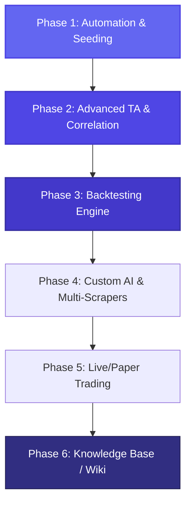

# 🚀 Roadmap & Evoluzioni Future - Trading & Sentiment AI (FinanceBuddy)

Questo documento definisce la visione strategica a breve, medio e lungo termine per l'evoluzione della piattaforma. La roadmap è suddivisa in step incrementali, ciascuno con indicazione degli obiettivi di business/funzionali e dello stack tecnologico consigliato.

---

---

## 📅 Fase 1: Automazione & Bootstrapping (Futuro Immediato)
**Obiettivo:** Consolidare l'applicazione self-hosted, automatizzare il caricamento iniziale ed ottimizzare le performance delle code Celery.

* **Funzionalità:**
  * Bootstrapping automatico dei dati storici (`yfinance` + notizie) al primo avvio tramite il comando `bootstrap_assets`.
  * Orchestrazione completa in Docker Compose (Web, DB, Redis, Worker, Beat).
  * Memorizzazione persistente dei modelli HuggingFace (FinBERT) per evitare download ripetuti su volumi Docker.
* **Tecnologie:**
  * **Backend:** Python 3.11+, Django 5.x, Celery 5.x.
  * **Database:** PostgreSQL 15+ (Alpine), Redis 7+ (Broker Celery).
  * **NLP:** HuggingFace Transformers, PyTorch (CPU-only per preservare memoria).
  * **Frontend:** TailwindCSS, Alpine.js, TradingView Lightweight Charts.

---

## 📈 Fase 2: Indicatori Tecnici & Correlazioni Avanzate (Futuro Prossimo)
**Obiettivo:** Unire l'analisi fondamentale guidata dal sentiment con l'analisi tecnica (TA) quantitativa.

* **Funzionalità:**
  * **Grafico a Doppia Timeline:** Visualizzazione degli indicatori tecnici principali (RSI, MACD, Medie Mobili Esponenziali EMA 20/50/200) sovrapposti alle candele dei prezzi.
  * **Matrice di Correlazione Matematica:** Calcolo automatico e visualizzazione dei coefficienti di correlazione di Pearson/Spearman tra i picchi di sentiment e le variazioni di prezzo a 1, 3 e 7 giorni.
  * **Sistema di Alert Automatici:** Invio di notifiche push (Telegram, Email, o Discord) quando un asset monitorato supera soglie critiche di sentiment (es. Sentiment < -0.6 -> potenziale panic selling).
* **Tecnologie:**
  * **Analisi Matematica:** `Pandas`, `NumPy`.
  * **Librerie Quantitative:** `TA-Lib` (Technical Analysis Library) o `pandas-ta` per il calcolo nativo in Python degli indicatori finanziari.
  * **Notifiche:** Telegram Bot API (`python-telegram-bot`), Django Signals per il triggering in background.

---

## 🧪 Fase 3: Motore di Backtesting delle Strategie ✅ *(Implementata)*
**Obiettivo:** Testare storicamente le strategie di trading basate sul sentiment per valutare se generano un reale "Alpha" (rendimento extra rispetto al mercato).

> **Stato:** completata con un backtester puro `pandas`/`numpy` ([core/backtest.py](core/backtest.py)) esposto su `/api/backtest/` e una "Strategy Sandbox" in dashboard (input regole, metriche, equity curve, marker BUY/SELL). `TimescaleDB` e `Backtrader`/`PyAlgoTrade` sono stati **rimandati**: il motore puro-pandas basta alla scala attuale ed evita i conflitti con numpy 2.x. Vedi [ARCHITECTURE.md §8](ARCHITECTURE.md#8-phase-status-vs-roadmapmd).

* **Funzionalità:**
  * **Strategia Sandbox:** Permettere all'utente di definire regole di trading (es. *"Compra se il sentiment a 3 giorni sale sopra 0.5; Vendi se scende sotto 0.1 o se si attiva uno stop-loss del 3%"*).
  * **Simulatore Storico (Backtester):** Eseguire la strategia sugli anni passati caricati nel database e calcolare metriche chiave: **Sharpe Ratio**, **Sortino Ratio**, **Maximum Drawdown** (perdita massima), e curva dei rendimenti (Equity Curve).
  * **Visualizzazione Grafica:** Mostrare i punti storici esatti di acquisto (Buy) e vendita (Sell) direttamente sulle candele del grafico interattivo.
* **Tecnologie:**
  * **Backtesting:** `Backtrader` o `PyAlgoTrade` (librerie standard Python per simulazioni di trading robuste).
  * **Database Time-Series:** Aggiornamento di PostgreSQL con l'estensione **TimescaleDB** per velocizzare le query analitiche storiche su milioni di record.
  * **Grafici:** `Chart.js` o grafici ad area di TradingView per visualizzare l'Equity Curve del portafoglio.

---

## 🤖 Fase 4: NLP Personalizzato & Scraping Multi-Canale (Medio-Lungo Termine) 🚧 *(in corso)*
**Obiettivo:** Estendere le fonti informative e addestrare modelli predittivi calibrati specificamente sulla propria cronologia locale di trading.

> **Stato:** avviata dal **filtro di rilevanza cold-start** (gradino 1 di 3). Implementati i campi
> `category`/`is_relevant`/`forward_impact` su `NewsArticle`, la categorizzazione per parole chiave per tema
> ([core/relevance.py](core/relevance.py)), il calcolo dell'impatto di prezzo forward a 1/3/7gg (riusa la
> correlazione della Fase 2, niente look-ahead), il task `update_news_relevance` e il filtro in dashboard
> (tema + Tutte/Rilevanti/Rumore + badge + impatto nel drawer). Aggiunto inoltre il **layer di qualità delle
> fonti** ([core/sources.py](core/sources.py) + registro curato): ogni articolo è taggato con tier
> (primaria/qualità/non verificata) + paese + lingua, così gli aggregatori (Insider Monkey, Stocktwits…) sono
> separati dalle testate serie (Reuters, Bloomberg, FT, WSJ, Il Sole 24 Ore, Nikkei, Handelsblatt, NRC,
> Caixin…); la dashboard mostra di default solo le testate verificate. Yahoo resta la fonte, con un filtro
> qualità sopra (e lo slot dove agganciare i futuri feed RSS/Reddit). Aggiunto il **gradino 2 — categorizzazione
> zero-shot (NLI)**: classificatore opzionale `facebook/bart-large-mnli` (`USE_ZERO_SHOT_NLP`, spento di default)
> che assegna il tema senza training, con fallback automatico alle parole chiave in caso di errore del modello.
> Aggiunti infine **NER (entity linking) + ingest RSS multi-paese**: [core/entities.py](core/entities.py) collega
> ogni articolo agli asset noti tramite dizionario di alias, e [core/rss.py](core/rss.py) + `fetch_rss_news`
> ingeriscono **25 feed RSS di testate di qualità in 11 paesi** (US/UK/DE/FR/IT/NL/ES/JP/HK/SG/IN — CNBC, FT,
> Economist, NYT, Guardian, Telegraph, BBC, Handelsblatt, FAZ, Spiegel, Le Monde, Il Sole 24 Ore, ANSA, Corriere,
> NRC, El País, Expansión, Nikkei, Japan Times, SCMP, Straits Times, Economic Times…), tutti validati dal vivo,
> attribuendo ogni notizia agli asset citati e taggandone il tier. Aggiunti poi (2026-06-11)
> l'**analisi di impatto per categoria** ([core/category_impact.py](core/category_impact.py) +
> `/api/category-impact/` + card "Quali temi muovono i prezzi" in home) — misura con le reazioni
> di mercato reali quali temi contano, il ponte verso il gradino 3 — e il **calendario earnings**
> (`Asset.next_earnings_date` via yfinance, task giornaliero a rotazione, badge "Earnings tra Xg"
> nel dettaglio asset). EDGAR/SEC valutato e rimandato: i feed Atom contengono solo metadati
> ("8-K — Apple Inc"), inutili per FinBERT e inquinanti per le medie di sentiment; ha senso solo
> con una pipeline dedicata ai filing, futura.
>
> ⚠️ **PROMEMORIA — gradino 3 DA FARE (rimandato, non completato).** Il
> **classificatore auto-supervisionato** addestrato sull'impatto di prezzo reale
> accumulato (`forward_impact`) — **il cuore dell'auto-calibrazione** — è stato
> rimandato il 2026-06-04 solo perché lo storico non è ancora abbastanza maturo
> per l'addestramento ("serve ~1 settimana+ di dati"; obiettivo reale ~1 anno).
> **Quando i dati saranno maturi va costruito:** auto-etichetta un articolo come
> "muove-mercato" quando |rendimento forward| supera una soglia di rumore,
> addestra un classificatore leggero (scikit-learn su feature testuali / embedding
> FinBERT), persistilo e ri-addestralo a intervalli. Restano aperti anche: Reddit
> (PRAW), NER a modello per organizzazioni non tracciate, fine-tuning locale di
> FinBERT; Twitter/X rimandato per costo API. Vedi
> [ARCHITECTURE.md §8](ARCHITECTURE.md#8-phase-status-vs-roadmapmd).

* **Funzionalità:**
  * **Filtro di Rilevanza Auto-Appreso (Self-Calibrating):** ✅ *cold-start implementato.* L'obiettivo finale è che il sistema **impari da solo** cosa è rilevante osservando la reazione di mercato alle notizie su una finestra lunga (~1 anno), senza regole scritte a mano. Pipeline a feedback: per ogni articolo si registra l'**impatto di prezzo forward** (rendimento a 1/3/7gg → vedi matrice di correlazione, Fase 2), si accumulano gli esempi e si addestra/aggiorna un classificatore che apprende quali temi muovono davvero il prezzo. Categorie d'interesse note a priori per il bootstrap: **earnings/bilanci, guidance, M&A, regolatorio/antitrust, geopolitica, politica monetaria/tassi, conferenze ed eventi aziendali**; rumore da scartare: cronaca nera, gossip, sport. Aggiungere al modello `NewsArticle` i campi `category`, `is_relevant` e `forward_impact` ed esporre il filtro in dashboard. Approccio incrementale: (1) keyword per tema (cold-start) ✅, (2) *zero-shot* NLI (es. `facebook/bart-large-mnli`) ✅, (3) **classificatore auto-supervisionato fine-tuned** etichettato dall'impatto di prezzo reale.
  * **Qualità delle fonti (allowlist):** ✅ *implementato.* Registro curato di testate affidabili con tier qualità + paese + lingua; ogni articolo è taggato e la dashboard mostra di default solo le testate verificate, scartando aggregatori/blog d'opinione. Pensato per accogliere anche fonti future.
  * **Scrapers Avanzati:** ✅ *feed RSS implementati.* Aggregare notizie non solo da Yahoo Finance, ma anche da feed RSS di testate di qualità (multi-paese) ✅ — Reddit (es. *r/wallstreetbets*, *r/investing*), canali Telegram finanziari, e profili chiave su Twitter/X (API a pagamento → posticipato) restano da fare.
  * **Universo titoli (top ~500 mondiale):** ✅ *implementato.* L'universo tracciato è la top ~500 mondiale per capitalizzazione ([core/data/global_top500.csv](core/data/global_top500.csv), ticker yfinance validati dal vivo), caricata da [core/universe.py](core/universe.py). Carico ottimizzato: prezzi scaricati in blocco (multi-ticker), backfill profondo solo per i nuovi titoli, news yfinance campionate + RSS/NER per la copertura ampia. L'utente può comunque aggiungere/rimuovere asset dalla dashboard.
  * **Fine-Tuning Locale:** Utilizzare lo storico dei prezzi e delle notizie salvate localmente per addestrare un classificatore leggero sopra le rappresentazioni (embeddings) di FinBERT, adattando l'AI al linguaggio specifico degli asset scelti.
  * **Riconoscimento delle Entità (NER):** ✅ *entity linking a dizionario implementato* ([core/entities.py](core/entities.py)) — rileva quali asset noti sono citati in un articolo generico e ve lo collega; un NER a modello per organizzazioni non ancora tracciate resta un'evoluzione futura.
* **Tecnologie:**
  * **Scraping:** `Scrapy`, `BeautifulSoup4`, `Selenium` (per pagine web dinamiche), Reddit API (`PRAW`), Twitter API.
  * **AI & Training:** `PyTorch`, `HuggingFace AutoTrain`, `scikit-learn` per addestrare classificatori personalizzati; modelli *zero-shot* NLI per la categorizzazione tematica senza training.

---

### ⭐ Classifica "Top Opportunità" (trasversale ai titoli) ✅ *(implementata)*
Con ~500 titoli serviva un modo per vedere subito i "migliori adesso" senza scorrerli a mano. Implementato un **punteggio composito 0-100** per ogni titolo ([core/ranking.py](core/ranking.py)) che combina **sentiment + sentiment in salita + tecnico (RSI/MACD) + momentum di prezzo** (pesi tarabili in `constants.py`); calcolato dal task `compute_rankings` in `AssetScore`, esposto su `/api/ranking/` e mostrato come **leaderboard in cima alla dashboard** (Migliori/Peggiori, click per aprire il titolo, componenti visibili per trasparenza). Etichettata "non è un consiglio d'acquisto".

---

### 🏠 Home "Panoramica" (vista d'apertura) ✅ *(implementata)*
All'apertura la dashboard **non seleziona più il primo asset**: mostra una **home/overview** con i dati più importanti a colpo d'occhio — card di sintesi mercato (sentiment medio 7g, news 24h, alert 7g, asset monitorati con il top score), gli **ultimi alert** su tutti i titoli (click → apre l'asset), la leaderboard **Top Opportunità** e la sezione **Paper Trading**. Il dettaglio asset (grafico, correlazioni, news, sandbox) si apre solo al click su un titolo, con pulsante "indietro" (e logo in sidebar) per tornare alla panoramica. Dati di sintesi dal nuovo endpoint `/api/summary/` (finestre in `constants.py`: `SUMMARY_NEWS_HOURS`, `SUMMARY_WINDOW_DAYS`); il resto riusa gli endpoint esistenti.

---

## 💸 Fase 5: Paper & Live Trading Automatizzato (Lungo Termine) ✅ *(Completata — broker/multi-utente rimandati)*
**Obiettivo:** Trasformare la piattaforma in un Trading Bot completo ed autonomo, capace di eseguire operazioni finanziarie reali o simulate.

> **Stato:** avviata dal **portafoglio virtuale (paper trading)** — la base. Un bot
> applica *in avanti nel tempo* la stessa strategia sentiment della Fase 3 (entra
> quando il sentiment medio mobile è forte, esce su inversione o stop-loss),
> investendo **denaro finto** (€10k iniziali): motore puro [core/paper_trading.py](core/paper_trading.py)
> (`latest_signal`, `position_size`), orchestrato dal task `run_paper_trading`
> (vende prima per liberare cassa + stop-loss, poi compra i segnali più forti con
> sizing a frazione di equity, tetto sul numero di posizioni, solo news da fonti
> verificate), con snapshot di equity ad ogni ciclo. Modelli Portfolio/Position/
> PaperTrade/PortfolioSnapshot, API `/api/portfolio/` + `/api/portfolio/history/`,
> sezione "Paper Trading" in dashboard (valore, rendimento, P&L, posizioni,
> operazioni, equity curve). Nessun broker, nessun rischio reale.
>
> Aggiunti poi due affinamenti **interni** (niente broker): **(a) costi di
> esecuzione realistici** — commissione (`PAPER_COMMISSION_PCT`) + slippage
> avverso (`TRADING_SLIPPAGE_PCT`) su ogni fill — modello condiviso in
> [core/execution.py](core/execution.py) e **applicato anche al backtester di
> Fase 3**, così la equity curve non è ottimistica, il P&L round-trip è al netto
> delle commissioni e backtest/paper della stessa strategia restano confrontabili;
> **(b) metriche di
> performance dal vivo** — Sharpe, Sortino, max drawdown, win rate, benchmark
> Buy & Hold equipesato sui titoli effettivamente tradati e **alpha**, calcolate
> dagli snapshot + operazioni chiuse riusando [core/metrics.py](core/metrics.py)
> (stessa matematica del backtester di Fase 3 → paper e backtest restano
> confrontabili), mostrate come riga "Performance" in dashboard con tooltip in
> linguaggio semplice.
>
> Aggiunto poi lo **streaming real-time via WebSocket** (Django Channels + Redis +
> Daphne/ASGI): la dashboard si sottoscrive a `ws/portfolio/` e si aggiorna da sola
> (valore, posizioni, operazioni, equity curve) a ogni ciclo del bot, senza
> ricaricare; il consumer ([core/consumers.py](core/consumers.py)) e l'endpoint REST
> condividono lo stesso payload ([core/portfolio.py](core/portfolio.py)), il
> broadcaster è [core/realtime.py](core/realtime.py). Fallback automatico a polling
> 60s + riconnessione se il socket cade.
>
> **Decisione (chiusura fase, 2026-06-10):** la fase è **completata** per tutto ciò
> che è in scope (simulazione completa: paper trading, costi di esecuzione realistici,
> metriche live, streaming WebSocket). Alpaca **non** è necessaria per la simulazione —
> costi e metriche sono modellati internamente; il broker è solo la rampa verso i soldi
> *veri* (rischio reale) e lo stack gira on-demand/intermittente, incompatibile con un
> bot collegato a un broker live. Il **multi-utente** ha senso solo insieme alle chiavi
> broker per più persone (piattaforma self-hosted a utente singolo → YAGNI). Entrambi
> ⏭ **rimandati**: da riprendere solo se/quando si deciderà di passare al denaro reale.
> Vedi [ARCHITECTURE.md §8](ARCHITECTURE.md#8-phase-status-vs-roadmapmd).

* **Funzionalità:**
  * **Paper Trading Dashboard:** ✅ *implementato.* Un portafoglio virtuale per simulare in tempo reale le performance del bot con denaro virtuale, calcolando profitti e perdite storiche.
  * **Connessione API Broker:** ⏭ *rimandata (fuori scope).* Integrazione con broker online per ordini automatici — è la rampa verso il denaro reale; da riprendere solo se si deciderà di andare live.
  * **Dashboard Multi-Utente:** ⏭ *rimandata (YAGNI).* Multi-account con crittografia delle chiavi broker — ha senso solo insieme al broker reale.
  * **Streaming Real-Time:** ✅ *implementato.* La dashboard riceve gli aggiornamenti del portafoglio in tempo reale via WebSocket (Django Channels), sostituendo il polling; resta un fallback a polling se il socket cade.
* **Tecnologie:**
  * **Broker API:** Alpaca Trade API (gratuita per il paper trading), `ib_insync` (per Interactive Brokers), CCXT (per Exchange di Criptovalute).
  * **Sicurezza:** Moduli crittografici di Python (`cryptography.fernet`) per salvare le chiavi API in modo ultra-sicuro nel database.
  * **Real-time WebSockets:** `Django Channels` per lo streaming bidirezionale a bassissima latenza tra server e client.

---

## 📚 Fase 6: Knowledge Base / Wiki Didattica (Fase Finale) ✅ *(Implementata)*
**Obiettivo:** Rendere la piattaforma **comprensibile a chi non sa nulla di trading**. Una sezione "Wiki" integrata nell'app che spiega — in linguaggio semplice, con esempi concreti e le formule matematiche — **ogni concetto** usato altrove nella dashboard, così che l'utente abbia sempre a portata di click la definizione di ciò che sta guardando.

> **Stato (2026-06-10): implementata.** Pagina statica `/wiki/` (template
> [core/templates/core/wiki.html](core/templates/core/wiki.html), `WikiView`) con lo
> stesso design system della dashboard: 7 sezioni tematiche + glossario alfabetico,
> ~40 voci tutte con la struttura ripetuta *(definizione → spiegazione semplice →
> esempio numerico → formula KaTeX → "dove lo vedi nell'app")*, bilingue IT/EN.
> Sidebar con indice attivo allo scroll, ricerca testuale live, ancore deep-linkabili
> (es. `/wiki/#sharpe`). La dashboard espone icone ℹ︎ contestuali (Top Opportunità,
> Paper Trading, Equity Curve, Performance, grafico/EMA, RSI, MACD, matrice di
> correlazione, Strategy Sandbox) + pulsante Wiki in sidebar. Smoke test in
> [core/tests/test_wiki.py](core/tests/test_wiki.py) vincolano rotta, template e
> ancore usate dai deep-link.

* **Principi di progettazione (UX):**
  * **Navigabile, non una lista infinita:** contenuti organizzati in **sezioni tematiche affini** (paragrafi), con indice/sommario laterale (sidebar), ancore per ogni voce e ricerca testuale. Niente muro di termini in ordine sparso.
  * **Struttura ripetuta per ogni concetto:** *(1) Definizione in una frase → (2) Spiegazione semplice "come se avessi 12 anni" → (3) Esempio numerico concreto → (4) Formula matematica (resa con LaTeX/KaTeX) → (5) "Dove lo vedi nell'app" con link alla card/grafico relativo.*
  * **Collegamento contestuale:** ogni metrica/grafico nella dashboard espone un'icona "ℹ︎/?" che apre direttamente la voce wiki corrispondente (deep-link ad ancora).
  * **Bilingue-friendly:** testo in italiano semplice (lingua dell'utente), con il termine inglese standard accanto (es. "Media Mobile Esponenziale — *EMA*").

* **Sezioni tematiche previste (paragrafi):**
  1. **Concetti di base dei mercati** — prezzo, candela OHLCV, volume, rendimento %, long/short, asset/ETF, timeframe.
  2. **Analisi del sentiment** — cos'è il sentiment, NLP, FinBERT, score (−1…+1) ed etichette, fallback a parole chiave.
  3. **Analisi tecnica (indicatori)** — Media Mobile Esponenziale (EMA 20/50/200), RSI (ipercomprato/ipervenduto), MACD (linea/segnale/istogramma); ciascuno con formula.
  4. **Statistica & correlazione** — correlazione di Pearson e Spearman, coefficiente, *forward return* a 1/3/7 giorni, campione minimo, causa≠effetto.
  5. **Strategia & backtesting** — cos'è una strategia, regole di entrata/uscita, stop-loss, *backtest*, *look-ahead bias*, perché serve storico.
  6. **Metriche di performance** — Equity Curve, Rendimento totale vs *Buy & Hold*, **Alpha**, **Sharpe Ratio**, **Sortino Ratio**, **Maximum Drawdown**, *win rate*; ognuna con formula ed esempio.
  7. **Rischio & avvertenze** — volatilità, rischio di perdita, limiti dei dati, "i rendimenti passati non garantiscono quelli futuri".
  8. **Glossario rapido** — indice alfabetico che rimanda alle voci sopra (per chi cerca un singolo termine).

* **Tecnologie:**
  * **Frontend:** pagina/route dedicata (`/wiki`) nel template Django, stesso design system (TailwindCSS, glassmorphism, Alpine.js per ricerca/filtro e indice attivo allo scroll).
  * **Formule:** **KaTeX** (via CDN) per il rendering matematico leggero e veloce.
  * **Contenuti:** sorgente in Markdown reso server-side, oppure sezioni statiche nel template; nessuna dipendenza pesante. Una singola fonte di verità per le definizioni, riusabile dai tooltip contestuali della dashboard.
